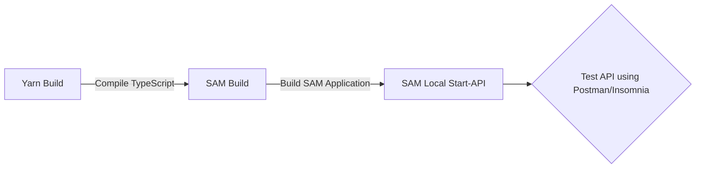

## This is the repo for our serverless apis
# Local Development and Testing of AWS Lambda Function

## Overview

This document describes the process for building and testing an AWS Lambda function locally using SAM (Serverless Application Model) and Yarn. It also covers invoking the function via an API endpoint using tools like Postman or Insomnia.


## Install yarn and SAM before you start building your process.

If you have never installed yarn or SAM before this project, you should install them first. There are few ways to do it, here we pick up an easy way, it will save your time.That is "Use npm to install yarn and SAM". You should do as follows:

 1. **Install npm**
    - Run the following command:
      ``` 
      npm install -g npm
      ```
      
 2. **Install yarn** 
    - Use npm to install yarn via the following command:
      ```
      npm i yarn --save
      ```
      
 3. **Install SAM**
    - Use npm to install SAM via the following command:
      ```
      npm i sam --save
      ```

## Build Process

The build process involves compiling the TypeScript code and preparing the Lambda function for local testing. The steps are as follows:

## !!! Make sure you have docker installed as api-gate-way will need Docker and the lambdas will be compiled to docker. [Download Docker Here](https://www.docker.com/products/docker-desktop/)


1. **Compile TypeScript Code**
   - Run the following command to compile the TypeScript code into JavaScript:
     ```
     yarn build
     ```

2. **Build SAM Application**
   - Build your SAM application which prepares your function for local testing:
     ```
     sam build
     ```

3. **Start Local API Gateway**
   - Start the local API Gateway to test the function:
     ```
     sam local start-api
     ```

## Testing the Function

After starting the local API Gateway, the function can be tested using HTTP requests.

1. **Invoke the Function**
   - Use a tool like Postman or Insomnia to send a GET request to the following URL:
     ```
     http://127.0.0.1:3000/hello-world
     ```

2. **Expected Response**
   - The function should return the following response:
     ```
     Hello World!
     ```

## Flow Diagram



## Notes

- Ensure you have Yarn, AWS SAM CLI, and a tool like Postman or Insomnia installed.
- Replace `http://127.0.0.1:3000/hello-world` with your function's endpoint if it's different.
- The response "Hello World!" assumes that your Lambda function is programmed to return this string.


## To build your postgres on local
- Run docker container first:
    ```
    docker compose up -d
    ```
- Then download [Dbeaver](https://dbeaver.io/download/) or [PGAdmin](https://www.pgadmin.org/download/)
- (Dbeaver has a bug with AWS VPC and SSL certificate but other than that Dbeaver is much better than PGAdmin)
- Go to you PG Admin and the env should be then you will be connected to the database and our main database
- Our main database is `ptedatabase`
    ```
    Name: Pte-app
    Host name/address: localhost
    Post: 5432
    Username: postgres
    Password: postgres
    ```